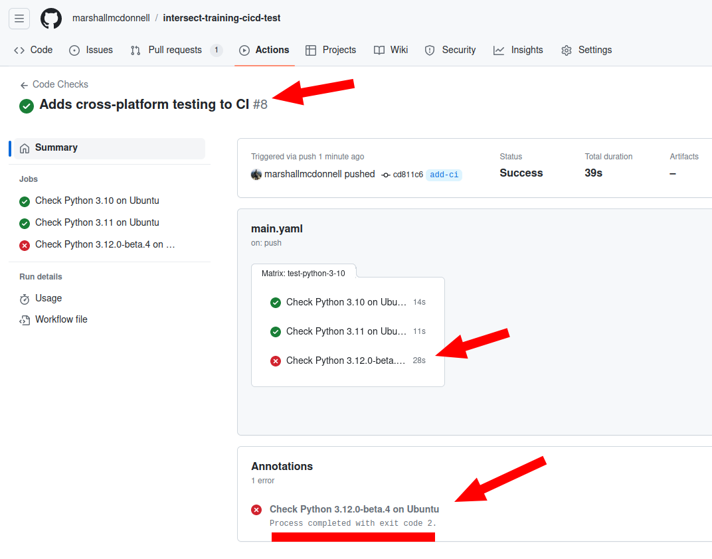
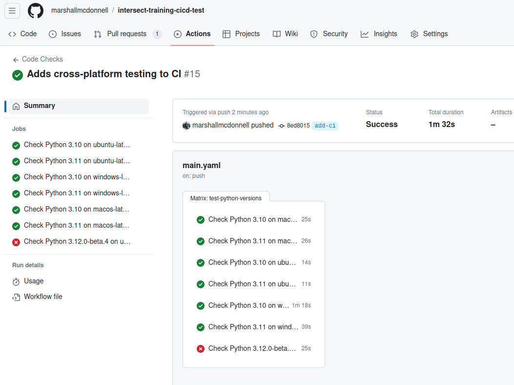
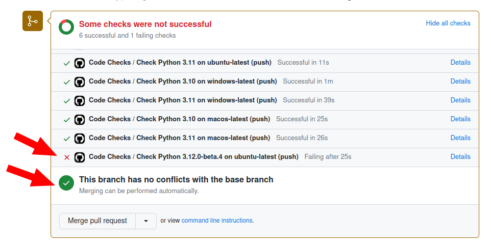

:::::::::::::::::::::::::::::::::::::: questions 

  - How do I run CI for multiple Python versions and /or different platforms?

::::::::::::::::::::::::::::::::::::::::::::::::

::::::::::::::::::::::::::::::::::::: objectives

  - Don't Repeat Yourself (DRY)
  - Use a single job for multiple jobs

::::::::::::::::::::::::::::::::::::::::::::::::


Let's assume our tests are running great.

Yet, the domain scientist reports they are getting errors when they run the Python package.

After talking with them, you find that they are running Python 3.11, not 3.10.

How do we include this version of Python in our testing?

# Multiple version Python testing - Naive Approach

One approach would be to add another job to run tests for Python 3.11 as well.

Up to this point, we currently have the following:
```yaml
name: Code Checks
on: push
jobs:
  greeting:
    runs-on: ubuntu-latest
    steps:
      - name: Greeting!
        run: echo hello world

  test-python-3-10:
    name: Check Python 3.10 on Ubuntu
    runs-on: ubuntu-latest
    steps:
      - uses: actions/checkout@v3

      - uses: actions/setup-python@v5
        with:
          python-version: "3.10"

      - name: Install package
        run: python -m pip install -e .[test]

      - name: Test package
        run: python -m pytest
```

Let's add testing a different version of Python in our CI!

::::::::::::::::::::::::::::::::::::: challenge

## Action: Add Python 3.11 test
First, remove the `greeting` job.

Then, add a new job called `test-python-3-11`.

Have this new job:

- Checkout the code
- Setup a Python 3.11 environment
- Install the package with our test dependencies
- Run the tests via `pytest`

:::::::::::::::  solution

## Solution

```yaml
name: Code Checks
on: push
jobs:

  test-python-3-10:
    name: Check Python 3.10 on Ubuntu
    runs-on: ubuntu-latest
    steps:
      - uses: actions/checkout@v3

      - uses: actions/setup-python@v5
        with:
          python-version: "3.10"

      - name: Install package
        run: python -m pip install -e .[test]

      - name: Test package
        run: python -m pytest

  test-python-3-11:
    name: Check Python 3.11 on Ubuntu
    runs-on: ubuntu-latest
    steps:
      - uses: actions/checkout@v3

      - uses: actions/setup-python@v5
        with:
          python-version: "3.11"

      - name: Install package
        run: python -m pip install -e .[test]

      - name: Test package
        run: python -m pytest
```

:::::::::::::::::::::::::

::::::::::::::::::::::::::::::::::::::::::::::::::


Now, let's add this so we can catch any Python 3.11 bugs going forward!

```bash
git add .github/workflows/main.yml
git commit -m "Adds job to CI for Python 3.11"
git push
```

Check the output!

{alt='Displays the output of multi-version Github Actions'}

Now, we do technically have multiple-versions of Python supported.

Yet, we just added 13 lines of identical code with only one character change...

## DRY your CI

"DRY" is an ancronym for ["Don't Repeat Yourself"][dry],
meaning don't have repeated code in your software.
This reduces repetition and avoids redundancy.

We do this for our software.
There is no reason we should not apply this principle to CI!

# Matrix


::::::::::::::::::::::::::::::::::::: callout

## Action: Building a matrix across different versions
We could do better using `matrix`. The latter allows us to test the code against a combination of versions in a single job.
Let's update our `.github/workflow/main.yml` and use `matrix`.
```yaml
name: Code Checks
on: push
jobs:

  test-python-versions:
    name: Check Python ${{ matrix.python-version }} on Ubuntu
    runs-on: ubuntu-latest
    strategy:
      matrix:
        python-version: ["3.10", "3.11"]
    steps:
      - uses: actions/checkout@v3

      - name: Setup Python ${{ matrix.python-version }}
        uses: actions/setup-python@v4
        with:
          python-version: ${{ matrix.python-version }}

      - name: Install package
        run: python -m pip install -e .[test]

      - name: Test package
        run: python -m pytest
```

YAML truncates trailing zeroes from a floating point number, which means that `version: [3.9, 3.10, 3.11]` will automatically be converted to `version: [3.9, 3.1, 3.11]` (notice `3.1` instead of `3.10`). The conversion will lead to unexpected failures  as your CI will be running on a version not specified by you. This behavior resulted in several failed jobs after the release of Python 3.10 on GitHub Actions. The conversion (and the build failure) can be avoided by converting the floating point number to strings - `version: ['3.9', '3.10', '3.11']`.

More details on matrix: [https://docs.github.com/en/actions/reference/workflow-syntax-for-github-actions](https://docs.github.com/en/actions/reference/workflow-syntax-for-github-actions#jobsjob_idstrategymatrix).

::::::::::::::::::::::::::::::::::::::::::::::::


We can push the changes to GitHub and see how it will look like.
```bash
git add .github/workflows/main.yml
git commit -m "Adds multi-version Python testing to CI via matrix"
git push
```

That is a much better way to add new versions and we have a DRY-compliant CI!

## Test experimental versions in CI

Sometimes in your matrix, you want to push the boundaries of your testing.

An example would be to test up to the latest alpha / beta release of a Python version.

You do not want a failure in such cutting-edge, unstable tests stopping your CI.

At time of writing, the latest supported beta version of Python for the `actions/python-versions` is 3.14.0-beta.4 based on their [GitHub Releases](https://github.com/actions/python-versions/releases).

Let's add this to our python version testing.

### Allow experimental jobs to fail in CI

This gets a little complicated, but there are a few flags we need to set.

GitHub Actions will cancel all in-progress and queued jobs in the matrix if any job in the matrix fails.

To disable this, we need to disable `fail-fast` in the matrix strategy.
```yaml
strategy:
  fail-fast: false
```

That should do it, right? Nope...

We have to add `continue-on-error: true` to a single job that we allow to fail.
If enabled, jobs in the matrix continue to run if there is an error.
By default `continue-on-error: false` and will also cancel the matrix jobs if the
"experimental" job fails.

```yaml
runs-on: ubuntu-latest
continue-on-error: true
```

More details: [https://docs.github.com/en/actions/using-workflows/workflow-syntax-for-github-actions#jobsjob_idstrategyfail-fast](https://docs.github.com/en/actions/using-workflows/workflow-syntax-for-github-actions#jobsjob_idstrategyfail-fast)

Finally, we need to add this experimental job to the matrix.
Also, we need to flag it as "allowed to fail" somehow.

For this, we use `include` to add a single extra job to the matrix with "metadata".
```yaml
strategy:
  matrix:
    include:
      - python-version: "3.14.0-beta.4"
        allow_failure: true
```

This will add the string `"3.14.0-beta.4"` to the `python-version`
list in matrix with the arbitrary variable `allow_failure` set to `true`
as "metadata".
We also must add the `allow_failure` "metadata" to the other members of the matrix (see below).

More detail: [https://docs.github.com/en/actions/using-workflows/workflow-syntax-for-github-actions#jobsjob_idstrategymatrixinclude](https://docs.github.com/en/actions/using-workflows/workflow-syntax-for-github-actions#jobsjob_idstrategymatrixinclude)


::::::::::::::::::::::::::::::::::::: callout

## Putting it together for Python experimental job...

So if we **only** want to allow the job with version set to `3.14.0-beta.4` to fail without failing the workflow run, we need something like:

Then the following would work for a job:
```yaml
jobs:
   job:
     runs-on: ubuntu-latest
     continue-on-error: ${{ matrix.allow_failure }}
     strategy:
       fail-fast: false 
       matrix:
         python-version: ["3.10", "3.11"]
         allow_failure: [false]
         include:
           - python-version: "3.14.0-beta.4"
             allow_failure: true
```

::::::::::::::::::::::::::::::::::::::::::::::::

Now to add it...

::::::::::::::::::::::::::::::::::::: challenge

## Action: Add experimental job that is allowed to fail in the matrix
Add "3.14.0-beta.4" to our current Python package CI YAML via the matrix but allow it to fail.

:::::::::::::::  solution

## Solution
Below is a solution for `.github/workflow/main.yml`:
```yaml
name: Code Checks
on: push
jobs:
 
  test-python-versions:
    name: Check Python ${{ matrix.python-version }} on Ubuntu
    runs-on: ubuntu-latest
    continue-on-error: ${{ matrix.allow_failure }}
    strategy:
      fail-fast: false
      matrix:
        python-version: ["3.10", "3.11"]
        allow_failure: [false]
        include:
          - python-version: "3.14.0-beta.4"
            allow_failure: true

    steps:
      - uses: actions/checkout@v3
 
      - name: Setup Python ${{ matrix.python-version }}
        uses: actions/setup-python@v4
        with:
          python-version: ${{ matrix.python-version }}
 
      - name: Install package
        run: python -m pip install -e .[test]

      - name: Test package
        run: python -m pytest
```

:::::::::::::::::::::::::

::::::::::::::::::::::::::::::::::::::::::::::::::

Let's commit this and see how it looks!

```bash
git add .github/workflows/main.yml
git commit -m "Adds experimental Python 3.14.0-beta.4 test to CI"
git push -u origin add-ci
```
We see that the overall workflow passed even though the Python 3.14.0-beta.4 job failed!

Also, note that we see that GitHub Actions reports an exit code that is non-zero!
Like previously discussed, exit codes are what CI tools / solution are built around.

{alt='Displays a failed action'}

::::::::::::::::::::::::::::::::::::: callout

## Experimental CI jobs

This allows us to run all kinds of "experimental" jobs.
Examples are trying new versions of software or checking deprecated versions.

::::::::::::::::::::::::::::::::::::::::::::::::

## Cross-platform testing

Uh oh... the domain scientist is back with an issue.

After talking with him, you find out his summer intern
cannot run the python package on their Windows machine.

You have Linux Ubuntu and your domain scientist collaborator / team member has Mac.

How do we test our Python package across Linux, Mac, and Windows (i.e. cross-platform)?

### Selecting the GitHub-hosted runner platform

We honestly already have what we need, the [`runs-on`][runs-on] command!

All we need to know is what values are allowed.

Inside of the `runs-on` documentation, there is a list of labels we can use to select the platform of the runner: [list of labels for runner types][runner-types]


::::::::::::::::::::::::::::::::::::: challenge

## Action: Find out the labels for all three platforms

Using the documentation links above, get the three "latest" labels for Linux, Mac, and Windows.

:::::::::::::::  solution

## Solution
* Linux: `ubuntu-latest`
* Mac: `macos-latest`
* Windows: `windows-latest`

:::::::::::::::::::::::::

::::::::::::::::::::::::::::::::::::::::::::::::::

Using these labels, we could create the following setup to run on all three platforms!
```yaml
jobs:
  test:
    runs-on: [ubuntu-latest, macos-latest, windows-latest]
```

::::::::::::::::::::::::::::::::::::: callout

## Not necessarily the best practice to use "latest"...
It is arguable but... using "latest" versions for the platforms may not be the best practice.
This practice is essentially testing versions of the platforms that will change, eventually, when the newest OS platform version is created for "latest".

This leaves you vulnerable to your CI breaking due to no change to the code.

However, this is a very infrequent change and probably fine to stay with "latest" so you don't have to change when the other eventual change will occur: a pinned version of the OS platform is deprecated and no longer available!

::::::::::::::::::::::::::::::::::::::::::::::::


::::::::::::::::::::::::::::::::::::: challenge

## Action: Add cross-platform testing to CI YAML

Using the "latest" labels, add Linux, Mac, and Windows testing to our current CI YAML.

HINT: You will need a variable under `matrix` that you use for `runs-on` and also for the `include`

:::::::::::::::  solution

## Solution
```yaml
name: Code Checks
on: push
jobs:
 
  test-python-versions:
    name: Check Python ${{ matrix.python-version }} on ${{ matrix.runs-on }}
    continue-on-error: ${{ matrix.allow_failure }}
    runs-on: ${{ matrix.runs-on }}
    strategy:
      fail-fast: false
      matrix:
        runs-on: [ubuntu-latest, windows-latest, macos-latest]
        python-version: ["3.10", "3.11"]
        allow_failure: [false]
        include:
          - python-version: "3.14.0-beta.4"
            runs-on: ubuntu-latest
            allow_failure: true

    steps:
      - uses: actions/checkout@v3

      - name: Setup Python ${{ matrix.python-version }}
        uses: actions/setup-python@v4
        with:
          python-version: ${{ matrix.python-version }}

      - name: Install package
        run: python -m pip install -e .[test]

      - name: Test package
        run: python -m pytest
```

:::::::::::::::::::::::::

::::::::::::::::::::::::::::::::::::::::::::::::::

Let's push these changes and see how it goes!

```bash
git add .github/workflows/main.yml
git commit -m "Adds cross-platform testing to CI"
git push
```

We see that now we are also testing across all the platforms!

{alt='Displays many cross platform Github Actions'}

## Pull Request

That wraps up the CI portion for the Python package.

If you'd like, you can add more steps to the jobs to perform other checks
(i.e. linting, format checks, documentation builds, etc.)

Once you are happy, let's use our open pull request for this branch and get it merged back into `main`!

You'll notice that the Pull Request shows us that a CI check didn't pass
but the overall workflow passed and able to be merged in!

{alt='Displays many cross platform actions on the pull request.'}

## Clean up local repository
To get your local repository up-to-date, you can run the following:
```bash
git checkout main
git pull
git remote prune origin # prune any branches deleted in the remote / GitHub that are still local
git branch -D add-ci # optional
```


::::::::::::::::::::::::::::::::::::: keypoints 

  - Matrix can help DRY your CI for multi-version and cross-platform testing
  - Using `matrix` allows to test the code against a combination of versions.

::::::::::::::::::::::::::::::::::::::::::::::::
