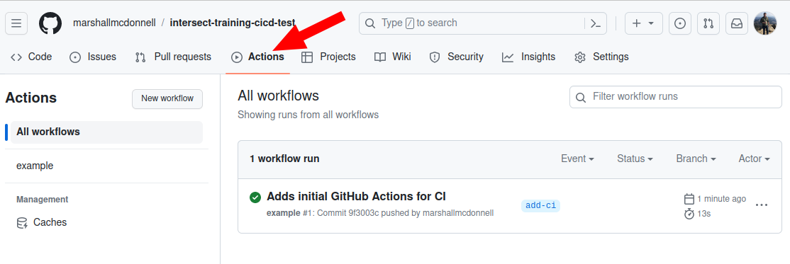
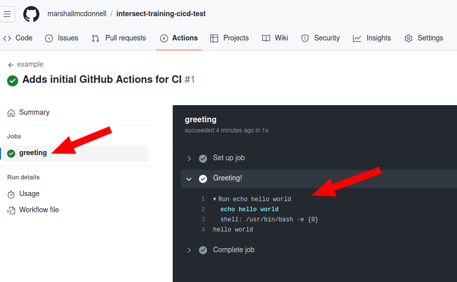
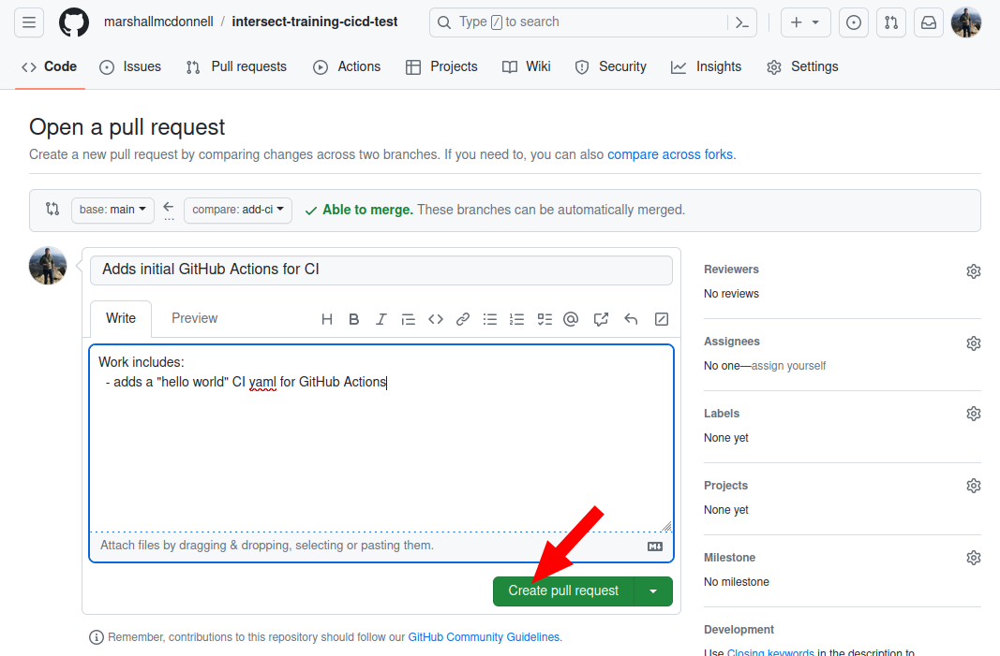
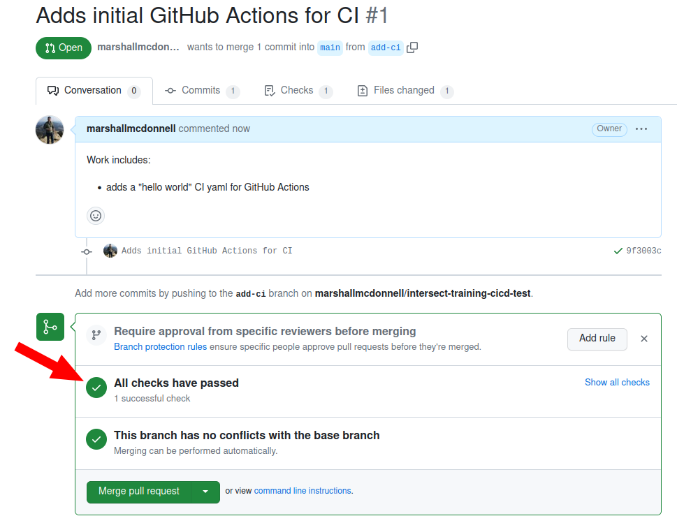

:::::::::::::::::::::::::::::::::::::: questions 

- How do I run a simple GitHub Actions job?

::::::::::::::::::::::::::::::::::::::::::::::::

::::::::::::::::::::::::::::::::::::: objectives

- Add CI/CD to your project.

::::::::::::::::::::::::::::::::::::::::::::::::


Now, we will be adding a GitHub Actions YAML file to a repository.
This is all we will need to run CI using GitHub Actions.

If you haven't already, use the [Setup instructions](https://intersect-training.org/CI-CD/index.html)
to get the example `intersect-training-cicd` repository setup locally
and remotely in GitHub.

## Adding CI/CD to a project

The first thing we'll do is create a `.github/workflows/main.yml` file in the project.
```bash
cd intersect-training-cicd
mkdir -p .github/workflows
```

Open `.github/workflows/main.yml` with your favorite editor and add the following

```yaml
name: example
on: push
jobs:
  greeting:
    runs-on: ubuntu-latest
    steps:
      - name: Greeting!
        run: echo hello world
```

## Run GitHub Actions

We've created the `.github/workflows/main.yml` file but it's not yet on GitHub.
Next step we'll push these changes to GitHub so that it can run our job.
Since we're adding a new feature (adding CI) to our project, we'll work in a feature branch.

```bash
git checkout -b add-ci
git add .github/workflows/main.yml
git commit -m "Adds initial GitHub Actions for CI"
git push -u origin add-ci
```

And that's it!
You've successfully run your CI job and you can view the output.
You just have to navigate to the GitHub webpage for the `intersect-training-cicd` project
and hit Actions button.
There, you will find details of your job (status, output,...).

{alt='where to find the github actions button'}

From this page, click through until you can find the output for the successful job run which should look like the following

{alt='how to see the output of a job run via Github Actions'}

## Pull Request

Lastly, we'll open up a pull request for this branch, since we plan to merge this back into `main` when we're happy with the first iteration of the Actions.

{alt='Displays the screen for creating a pull request'}

See the beauty of the passing CI checks for your pull request!

{alt='Displays the screen after the jobs have run on a created pull request'}

:::::::::::::::::::::::::::::::::::::: callout 
## Don't merge yet!

We will just continue this Pull Request as we continue.
Don't merge into `main` yet.

::::::::::::::::::::::::::::::::::::::::::::::::

::::::::::::::::::::::::::::::::::::: keypoints 

- Creating `.github/workflows/main.yml` is the first step to CI/CD.
- Pipelines are made of jobs with steps.

::::::::::::::::::::::::::::::::::::::::::::::::
